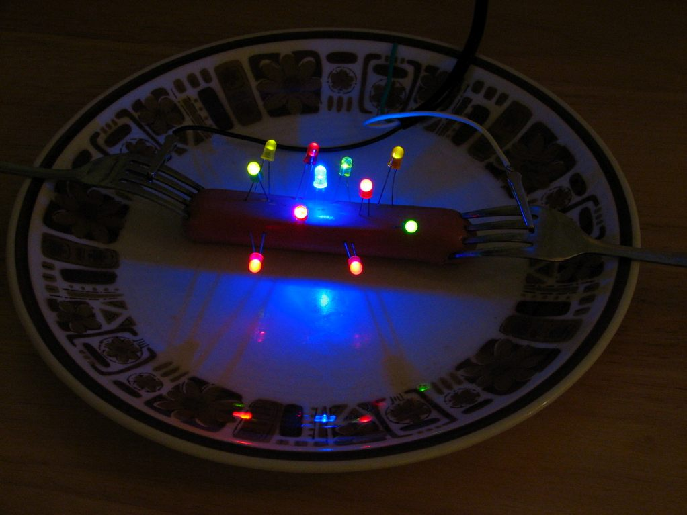

# introToIM
## a little smaller
### what does this look like?
#### this is four hashmarks
here is the description of my amazing project. I built a robot that flies.
This robot is battery powered.
etc.
etc.

this is a new paragraph. here is my robot.

how do I make **this** bold?

Here is an image that is on the web:


Here I am including the file with locally



Here is the code I had trouble with:

````
circle(12,23,34);
size(100,110);
line(1,2,3,4);
````
